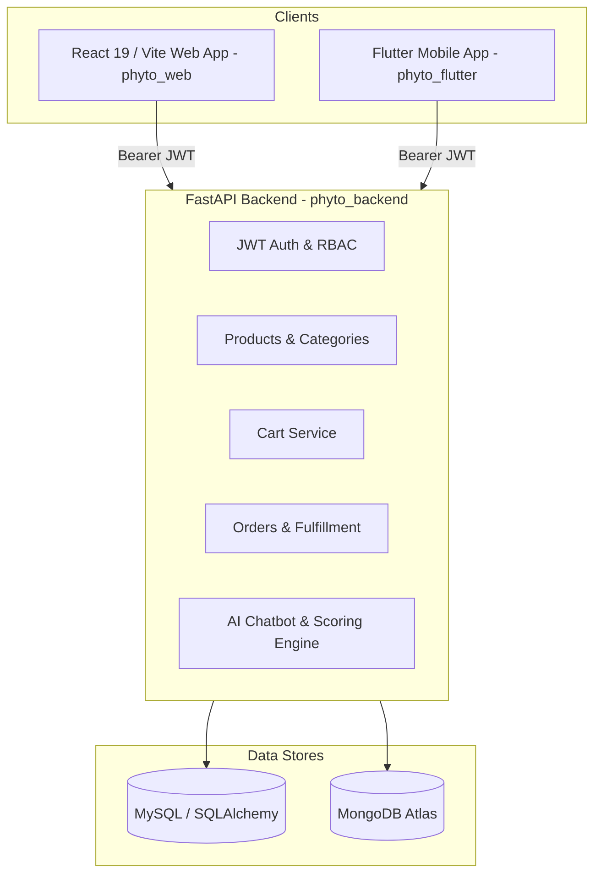

....
# 🌱 Phyto — Botanical E-Commerce Platform

Phyto connects local nurseries and verified growers directly to urban and semi-urban homes through a regional e-commerce platform with a grounded AI plant recommender, zoned logistics, and multi-channel client applications.

OUR LINK:[httpsphyto-seven.vercel.app](https://phyto-seven.vercel.app/)

OUR SCANNER:


---

## 🏛️ System Architecture



---

## 🚀 Getting Started

### 1. Backend (`phyto_backend`)

```bash
cd phyto_backend

# 1. Install dependencies
pip install -r requirements.txt

# 2. Configure environment
cp .env.example .env

# 3. Run unit tests
pytest -v

# 4. Start development server
uvicorn app.main:app --reload --port 8000
```
Interactive API documentation will be available at [http://localhost:8000/docs](http://localhost:8000/docs).

### 2. Web App (`phyto_web`)

```bash
cd phyto_web

# 1. Install dependencies
npm install

# 2. Configure environment
cp .env.example .env
# Ensure VITE_API_URL=http://localhost:8000

# 3. Start development server
npm run dev

# 4. Build for production
npm run build
```

### 3. Mobile App (`phyto_flutter`)

```bash
cd phyto_flutter

# 1. Get packages
flutter pub get

# 2. Run application
flutter run
```

---

## 🔑 Key Environment Variables

| Variable | App | Purpose |
|---|---|---|
| `DB_USER`, `DB_PASSWORD`, `DB_HOST`, `DB_PORT`, `DB_NAME` | Backend | MySQL connection configuration |
| `SECRET_KEY` | Backend | JWT signing key (HS256) |
| `ALLOWED_ORIGINS` | Backend | CORS allowed origins (comma-separated) |
| `MONGODB_URL`, `MONGODB_DB_NAME` | Backend | MongoDB Atlas connection string |
| `ANTHROPIC_API_KEY` | Backend | Optional Anthropic key for AI chatbot |
| `TREFLE_API_TOKEN` | Backend | Optional botanical data API token |
| `VITE_API_URL` | Web | FastAPI backend endpoint (e.g. `http://localhost:8000`) |
| `API_BASE_URL` | Mobile | FastAPI backend endpoint (e.g. `http://localhost:8000`) |
=======
# Phyto-
Phyto is a regional, multilingual plant-commerce platform connecting local nurseries and verified growers with urban and semi-urban homes. It offers plants, flowers, seeds and gardening kits with customised pots, hyperlocal delivery and gardener servicesv.It enables shopping while streamlining sourcing, quality, packaging and delivery zone by zone.
Phyto connects local nurseries and verified growers directly with urban and semi-urban homes through a regional, multilingual e-commerce platform.
A smart supply-chain system manages sourcing, quality checks, inventory, customised potting, moisture-lock packaging, and last-mile delivery, organised zone-by-zone for hyperlocal efficiency. We source plants and flowers directly from local nurseries and verified growers, reducing middlemen and improving freshness.
Powered by Bhashini, Phyto supports regional languages across product listings, checkout, and customer support, helping local growers and customers overcome language barriers.
Customers can shop indoor/outdoor plants, fresh flowers, seeds, and DIY gardening kits, customise pots and accessories, and book professional gardeners for planting and maintenance.
Revenue comes from sales margins, customisation, delivery and gardener service fees, nursery partnerships, and featured listings, creating a scalable plant ecosystem built zone-by-zone and language-by-language.
